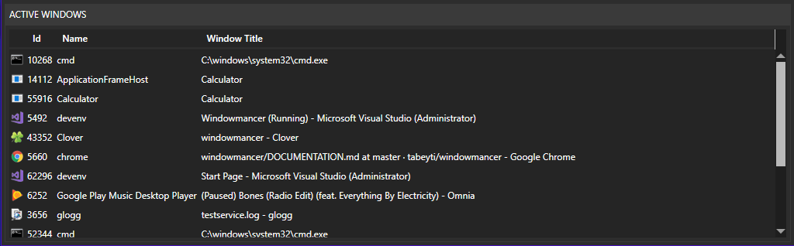
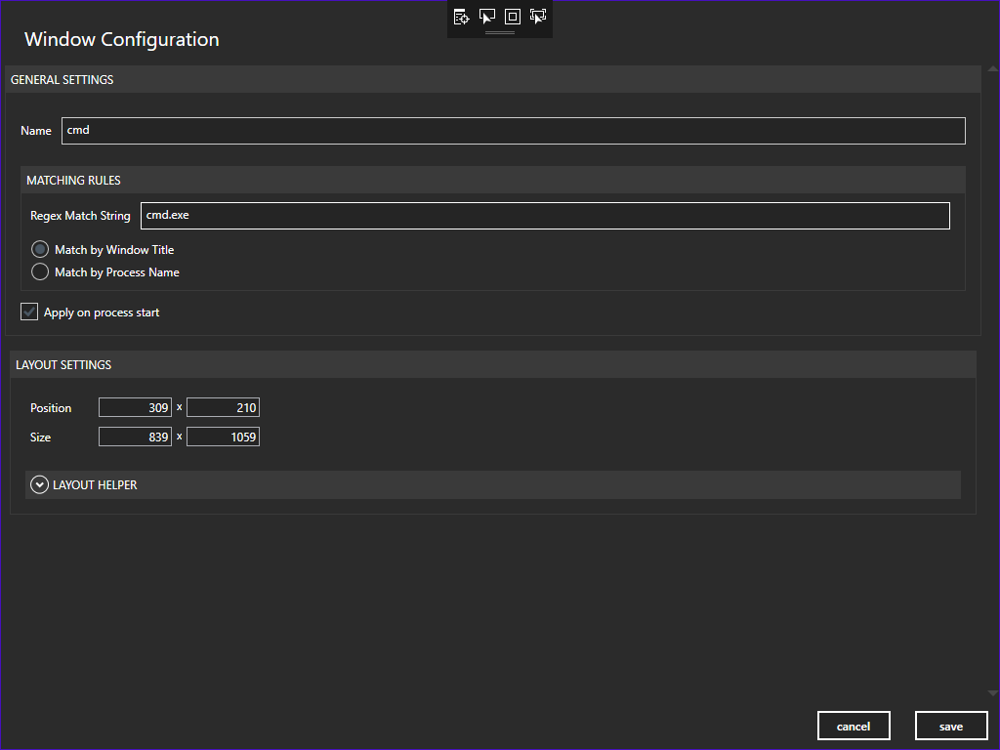
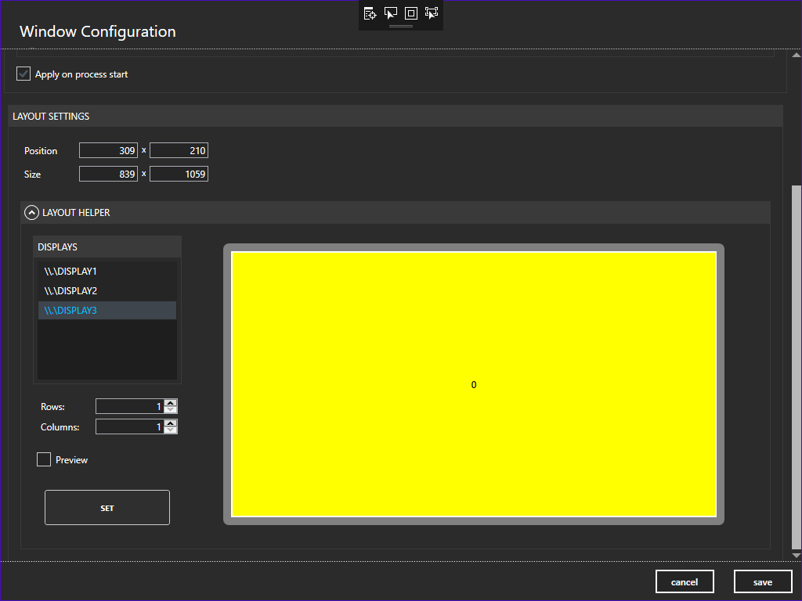
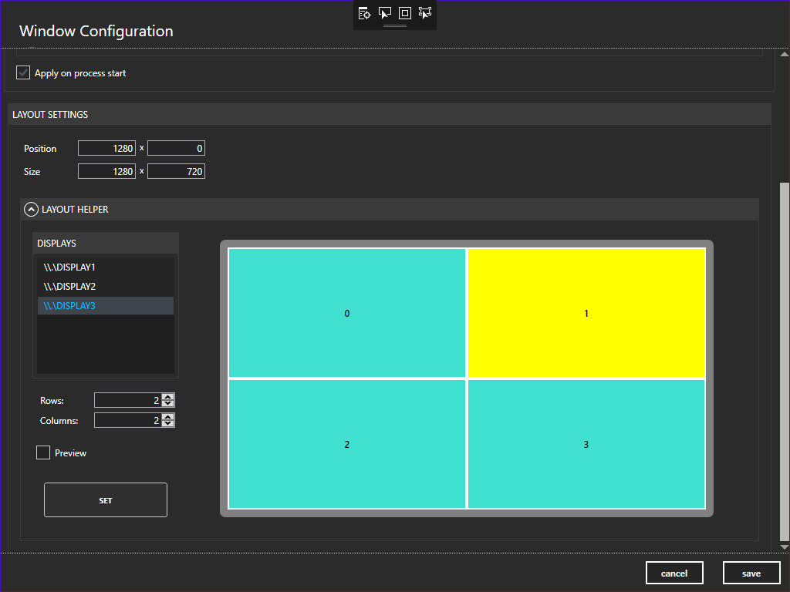
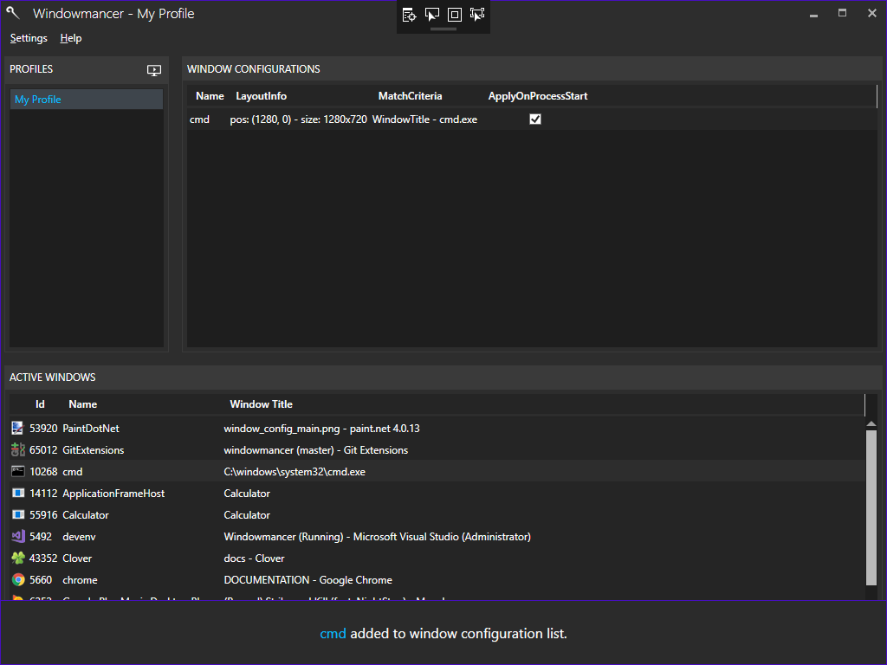

# Documentation

Run Windowmancer.exe. You should see the Windowmancer logo show in your system tray and the Editor window appear on your screen.

The editor window allows you to select active windows on your desktop and create "Window Configurations" on selected windows. 

## Editor
The place to add/remove/edit **Profiles** and **Window Configurations**.

### Window Configuration and Editor
A window configuration is a defintion for how we want the application to treat a process-window on re-scan or process startup. Window configurations are added/edited via the Window Configuration Editor. You get here by either double clicking an Active Window process, double clicking an existing window configuration in the data grid, or right-click **Add** within the data grid.

#### Name
The name of the window configuration you are making.
#### Regex Match String
A regular expression which will be used to locate your window whenever it appears OR when you rescan your Profile.
#### Apply on process start
Flag indicating whether to apply the window configuration when the targeted window process starts up.
#### Position
The absolute position of the process window. Whatever is in the x/y boxes here is where the window will appear during rescan.
#### Size
The absolute size of the process window. Whatever is in the width/height boxes here is the width/height the window will be during rescan.

#### Layout Manager
A helper panel that allows the user to define a grid on a selected monitor, and choose a section for where you want the window to appear during rescan.
##### Displays
A list box showing all the monitors currently connected. By default the **Primary** display is selected.
##### Rows/Columns
The number of rows and columns you want on the display box to hold.
##### Preview
Moves the actual process-window (if any) in real-time to see your changes before setting them.
##### Set
Sets the selected display section information to the **Size** and **Position** value boxes of the window configuration.

### Profile
A profile holds a set of window configurations. Profiles are useful for managing different sets of window layouts for different tasks. An real-world example would be a profile "Local" which defines window layouts when you are physically working on the machine (maybe you have three monitors), and a separate profile "RDP" with alternate layouts for when you are RDPed into that same machine (maybe resolution and monitor count is different).

#### Name
The name of the profile.

## System Tray App
The system tray app runs in the background so the user doesn't have to have the Editor window open in order to keep the application running. Also, to partially mitigate having the user constantly open the editor to switch between profiles, the system tray app icon gives the user this ability right-click via context menu. The user can also re-scan their profile through this avenue as well.

# Example
### Move "cmd.exe" window to top right quadrant of the primary monitor.

Let's say we would always like "cmd.exe" command prompt window to appear in the top left corner of our screen.
1. Open the Editor by going to the system tray and double clicking the application icon, or right clicking application icon and selecting **Open**. For simplicity, we will use the current Profile "My Profile" to add our new window configuration.

3. Locate the "cmd.exe" process-window in the **Active Windows** grid at the bottom of the editor.

Double click the row.

4. You will now be in the "Window Configuration Editor" section of the application. You will see that many of the fields are filled out with default information.

** If you want, change **Name** to "cmd.exe".
** Change **Regex Match String** to just "cmd.exe", keeping the option **Match by Window Title** option.

5. Since we want the window in the top right quadrant of our monitor, click the drop down arrow next to **Layout Manager**.

6. You will now see the window **Layout Helper** pane appear. 

This pane allows you to define grid boundaries for your window to live in by altering the row/column spinners and selecting a **Display Section** in the monitor box. By default, the defined grid only has 1 row and column. 
Change **Rows/Columns** to **2**.

7. You can see the number of display sections change in the monitor. Since we want the top right quadrant of our monitor, click the top right quadrant in the monitor box.
** NOTE: ** You can click the **Preview** button to preview the actual window in the location you want as you adjust rows/columns and display section selection.

8. Once you are ready to set the layout, click the button **Set**. You should see the **Position** and **Size** values in **Layout Settings** section change to the values cooresponding to the display section selected in the **Layout Helper**.

9. Go ahead and click **Save** or hit **Enter** on your keyboard to save your window configuration. You will now see your window configuration added to the **Window Configuration** grid, as well as a toast saying **cmd** has been added to the window configuration list.

11. To try out our new window configuration, either click the re-scan button in the **Profiles** section header , or execute the global hot-key combination for rescan (Default hot-key combination is CTRL+SHIFT+W. This can be changed in **Settings**->**Preferences**). You should see our **cmd.exe** window jump to the upper-right quadrant of your primary monitor.